# dsh-bridge

<p align="center">
  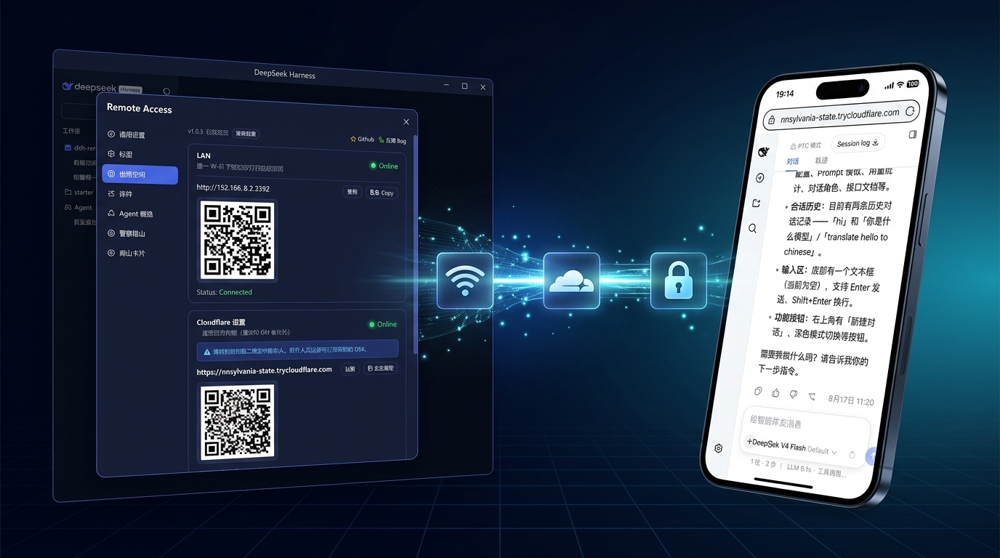
</p>

<p align="center">
  <a href="https://www.npmjs.com/package/@wenbin_wb/dsh-bridge"></a>
  <a href="https://www.npmjs.com/package/@wenbin_wb/dsh-bridge"></a>
  <a href="https://github.com/wenbin-wb/dsh-bridge/releases"></a>
  <a href="https://github.com/wenbin-wb/dsh-bridge/stargazers"></a>
  <a href="https://nodejs.org/"></a>
  <a href="LICENSE"></a>
</p>

<p align="center">
  
  
  
  
  
  
</p>

<p align="center">
  <a href="README.md">简体中文</a> | <b>English</b>
</p>

> **Multi-Channel Remote Access & Comprehensive Security Gateway Plugin for DeepSeek Harness**
> 
> Scan a QR code on your phone to continue using DeepSeek Harness anywhere. Whether relaxing on the sofa, commuting, or working across networks—no need to stay at your PC or set up complex servers.
> 
> Seamlessly extends your local DeepSeek Harness instance to mobile web, standalone PWA app, secure public tunnels, and **WeChat / QQ / Feishu / Telegram** bot matrix. Drive AI coding, run tasks, approve operations, and manage workspaces anytime, anywhere.

---

## Table of Contents

- [✨ Key Features](#-key-features)
- [📦 Requirements & Installation](#-requirements--installation)
- [🚀 Core Features & Usage Guide](#-core-features--usage-guide)
  - [1. 🛜 LAN Access & Multi-NIC Smart Selection](#1-🛜-lan-access--multi-nic-smart-selection)
  - [2. 🌐 Public Tunnels (Cloudflare & Custom)](#2-🌐-public-tunnels-cloudflare--custom)
  - [3. 📱 Mobile Experience & Standalone PWA](#3-📱-mobile-experience--standalone-pwa)
  - [4. 🗂️ Web Remote Workspace Directory Picker](#4-🗂️-web-remote-workspace-directory-picker)
  - [5. 🔐 Comprehensive Access Security & Admin Lock](#5-🔐-comprehensive-access-security--admin-lock)
  - [6. 🤖 All-in-One IM Bot Matrix (WeChat / QQ / Feishu / Telegram)](#6-🤖-all-in-one-im-bot-matrix-wechat--qq--feishu--telegram)
  - [7. 📊 Maintenance Dashboard & Graceful Restart](#7-📊-maintenance-dashboard--graceful-restart)
- [💬 FAQ](#-faq)
- [🛠️ Development & Contribution](#️-development--contribution)
- [📄 License](#-license)

---

## ✨ Key Features

- **🛜 Multi-NIC Smart Detection & Switching**: Automatically detects physical Wi-Fi, Ethernet, and virtual NICs (WSL/VMware/Docker); provides visual switching with persistent memory;
- **🌐 Dual-Mode Cloudflare Public Tunnels**: Zero-login 1-click random temporary domains or Cloudflare Named Tunnel Token with auto-start on boot;
- **📱 Native-Grade Mobile UI & PWA**: Centered session header, native drawer sidebar with `[|` fold icon, anti-overlap responsive layout, PWA install support;
- **🗂️ Web Remote Workspace Directory Picker**: Mobile/remote visits pop up responsive tree directory browser; localhost visits route to OS native dialogs; supports `/addworkspace` IM command;
- **🔐 Comprehensive Access Security & Dual Defenses**: QR code secret Token login, visitor password gate, independent admin anti-tamper lock; host physical privilege (`127.0.0.1`) & emergency terminal reset (`reset-auth`);
- **🤖 All-in-One IM Bot Matrix (WeChat / QQ / Feishu / Telegram)**: Multi-workspace dispatching, cross-restart session persistence, streaming Markdown typewriter, Card 2.0 interactive approvals, and bidirectional file sharing;
- **📊 Maintenance & Smooth Upgrades**: Host CPU / RAM / Uptime metrics, 1-click network diagnosis, JSON configuration backup & restore, npmmirror fast check & graceful restart.

---

## 📦 Requirements & Installation

### Requirements

1. **Node.js ≥ 22** (DSH requires `^22.19.0` or `≥ 24.0.0`)
2. **dsh CLI available** (runnable directly in terminal)

```bash
# Verify environment
node -v   # v22.19+ or v24+
dsh --version
```

### Installation

```bash
# Method 1: Install from npm (Recommended)
dsh plugin --profile web add @wenbin_wb/dsh-bridge

# Method 2: Global-permission-free npx installation
npx --yes @deepseek-ai/dsh plugin --profile web add @wenbin_wb/dsh-bridge

# Method 3: Install from source
git clone https://github.com/wenbin-wb/dsh-bridge.git
dsh plugin --profile web add ./dsh-bridge
```

### Upgrade

```bash
# Recommended: Click "🚀 1-Click Upgrade & Restart" in Web Settings > Remote Access

# Or force install latest version via CLI:
dsh plugin --profile web add @wenbin_wb/dsh-bridge@latest
```

---

## 🚀 Core Features & Usage Guide

Launch DeepSeek Harness, open Settings in the left sidebar, and click **"Remote Access"**:

---

### 1. 🛜 LAN Access & Multi-NIC Smart Selection

Starts **automatically with DSH service**, zero configuration required.

<p align="center">
  
</p>

* **Instant QR Code Scan**: Connect phone and PC to the same Wi-Fi, scan the QR code with phone camera to access mobile web UI;
* **Multi-NIC Detection & Switching**: Automatically detects multiple network interfaces (physical Wi-Fi, Ethernet, WSL, VMware, Docker) and presents **"🛜 Network Interface / IP Selection"** dropdown; instantly regenerates QR codes upon selection and **persists choice across restarts**.

---

### 2. 🌐 Public Tunnels (Cloudflare & Custom)

Access DeepSeek Harness from anywhere outside your home network without public IP or router port forwarding:

<p align="center">
  
</p>

- **Mode 1: Zero-Login Temporary Tunnel (Default)**:
  - Click "Start"; automatically prepares `cloudflared` binary with permission self-healing;
  - Instantly generates `https://*.trycloudflare.com` URL and QR code.
- **Mode 2: Cloudflare Token Fixed Domain (Permanent · Free)**:
  - Create a Tunnel in [Cloudflare Zero Trust Console](https://one.dash.cloudflare.com/) and bind your custom domain;
  - Enter Tunnel Token & hostname in Advanced Settings, enable **"Auto-start with DSH"** for permanent fixed URL!
- **Mode 3: Custom WebSocket Tunnel**:
  - Connect to your personal VPS reverse proxy server ([View Setup Guide](docs/custom-tunnel.md)), equipped with per-message gzip and SSE optimization.

---

### 3. 📱 Mobile Experience & Standalone PWA

Deeply optimized for mobile screens and touch interactions:

- **Clean Top Header**: Retains left drawer and right new session button, with centered dynamic session title;
- **Native Sidebar Drawer**: Full DSH history & workspace grouping with native `[|` fold icon and swipe gestures;
- **Standalone PWA Support**: Click "Add to Home Screen" in mobile browser to run as a 100% standalone fullscreen app;
- **Anti-Overlap Responsive Layout**: Bottom toolbar adapts to screen width, preventing button collision.

#### Mobile Chat & Workspace Experience

<p align="center">
  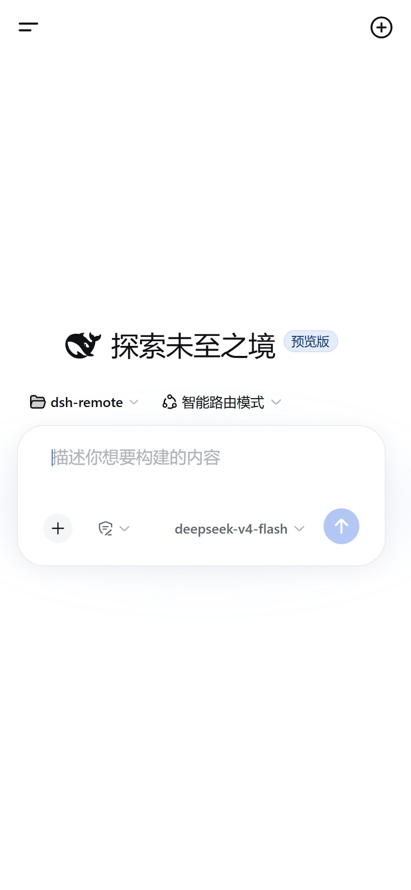
  &nbsp;
  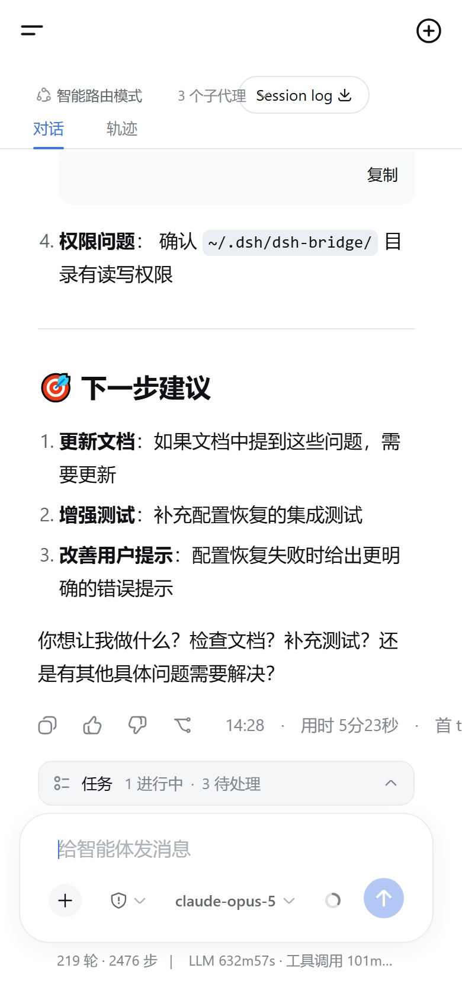
  &nbsp;
  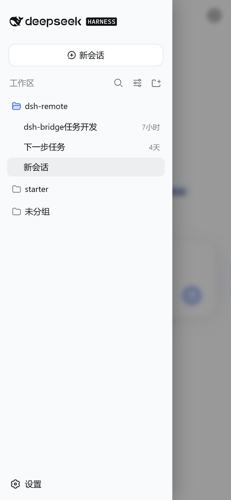
  &nbsp;
  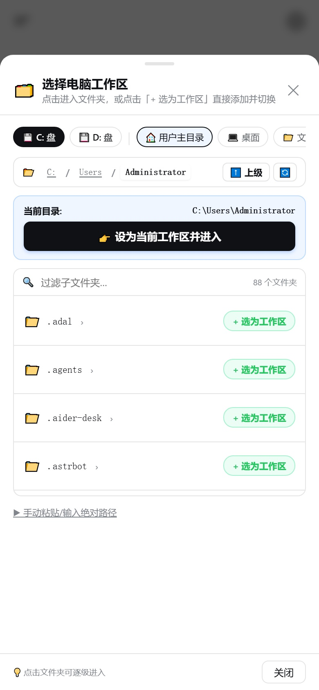
</p>

#### Remote Settings Center on Mobile

<p align="center">
  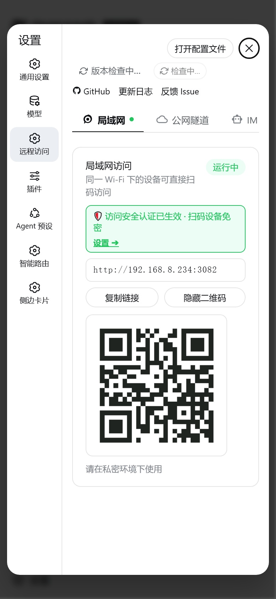
  &nbsp;
  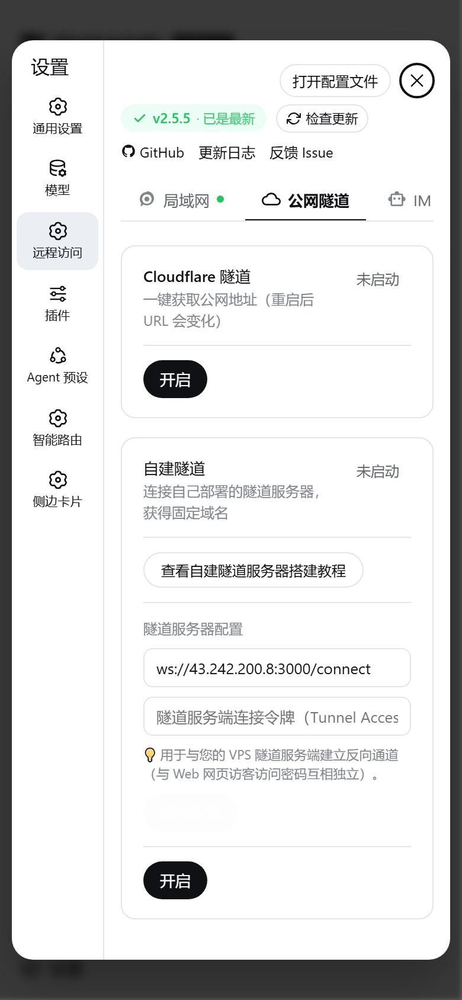
  &nbsp;
  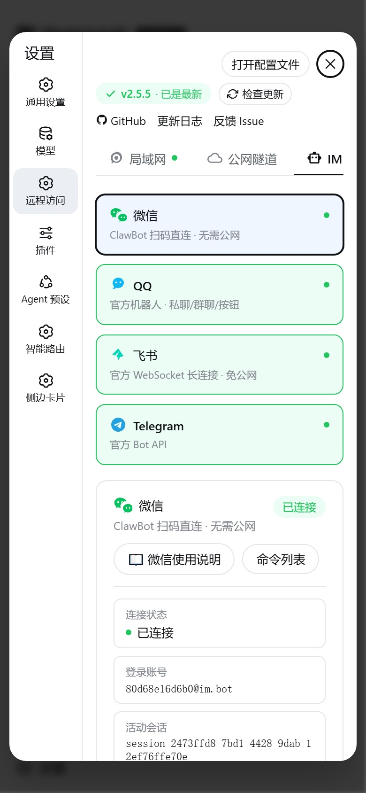
  &nbsp;
  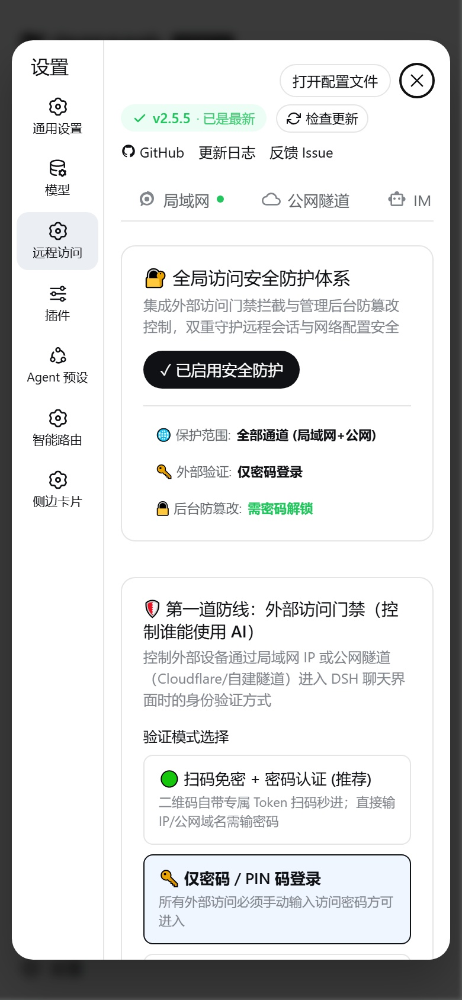
</p>

---

### 4. 🗂️ Web Remote Workspace Directory Picker

Solves the pain point of mobile browsers being unable to trigger PC native folder dialogs:

<p align="center">
  
</p>

* **Smart Routing**: PC localhost visits (`127.0.0.1`) invoke OS native file dialogs; mobile/remote visits pop up responsive bottom directory browser;
* **Quick Access**: 1-click access to Windows drives (C:, D:) and standard system folders (Desktop, Documents, Downloads, Projects).

---

### 5. 🔐 Comprehensive Access Security & Admin Lock

Open **"Security"** tab to establish bank-grade protection for your local development environment:

<p align="center">
  
</p>

#### 1. 🛡️ Line 1: External Access Gateway
- **QR Token Passwordless + Password Verification**: QR codes carry 256-bit encrypted Token for instant access; manual IP/domain visits require password;
- **Channel Isolation**: Choose between "All Channels / Public Tunnels Only (LAN Passwordless) / LAN Only".

<details>
  <summary>📱 Click to view Remote Access Login Page</summary>
  <br/>
  <p align="center">
    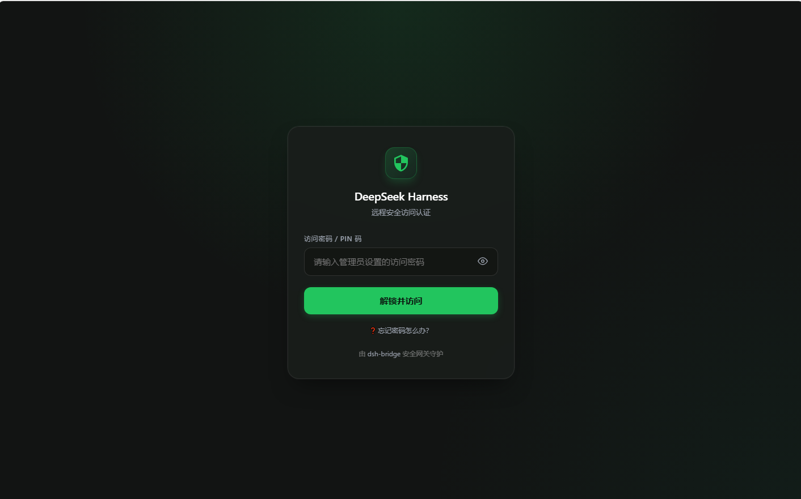
  </p>
</details>

#### 2. 🔒 Line 2: Admin Console Anti-Tamper Lock
- **Independent Admin Password**: Remote devices enter locked console, requiring admin password to view or modify tokens and bot configs;
- **Strict Host Policy**: Option to restrict management solely to host machine (`127.0.0.1`).

<details>
  <summary>🖥️ Click to view Admin Console Lock Screen</summary>
  <br/>
  <p align="center">
    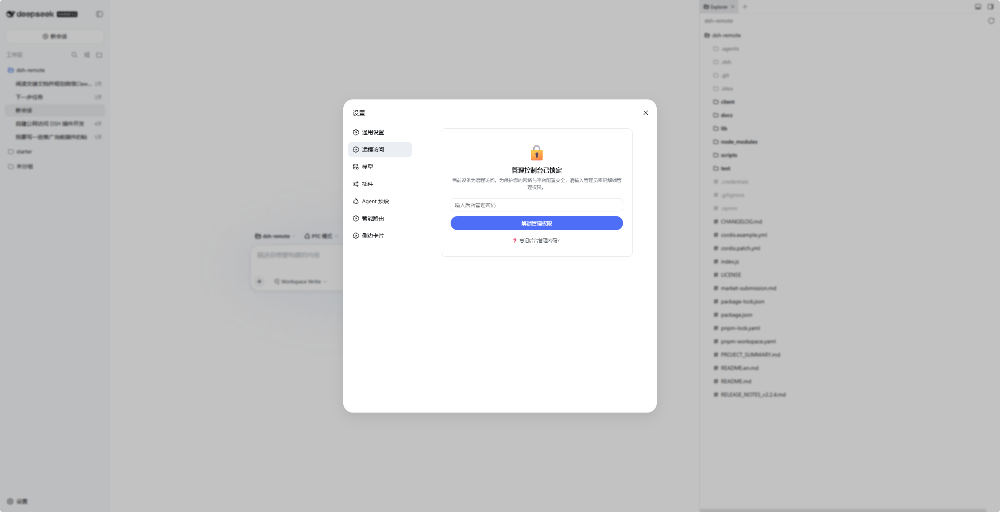
  </p>
</details>

#### 3. 🛟 Triple Disaster Recovery (Never Locked Out)
- **Host Physical Privilege**: PC localhost (`127.0.0.1`) enjoys permanent highest privilege, never locked;
- **Terminal Emergency Reset**: Run `touch ~/.dsh-bridge/reset-auth` in terminal to reset passwords instantly;
- **Interactive Guidance**: Built-in interactive recovery guides on all auth pages.

---

### 6. 🤖 All-in-One IM Bot Matrix (WeChat / QQ / Feishu / Telegram)

Interact with local AI agents directly inside your favorite messaging apps without opening a browser:

---

#### 🟢 WeChat Bot (ClawBot / iLink)

Scan QR code with personal WeChat account to chat, manage sessions, and approve permissions via official Tencent servers without public IP.

<p align="center">
  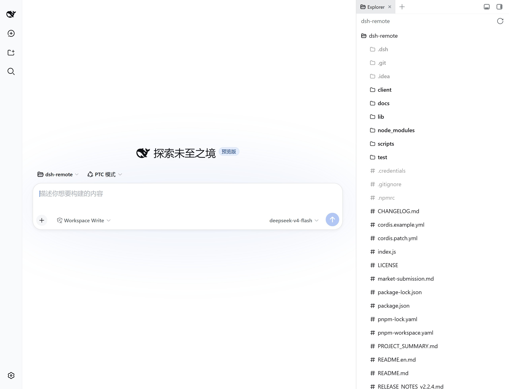
</p>

<details>
  <summary>📱 Click to view WeChat Chat & Approval</summary>
  <br/>
  <p align="center">
    
  </p>
</details>

* **Quick Setup**: Remote Access > IM Bot > WeChat > Scan QR code > Send first message to auto-authorize. See [WeChat Guide](docs/wechat-usage.md).

---

#### 🐧 QQ Bot (OpenAPI v2)

Official QQ Bot with direct/group @chat, Markdown rendering, interactive button keyboards, and rich media transfers.

<p align="center">
  
</p>

<details>
  <summary>📱 Click to view QQ Direct & Group Chat</summary>
  <br/>
  <p align="center">
    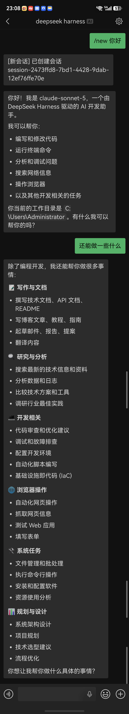
    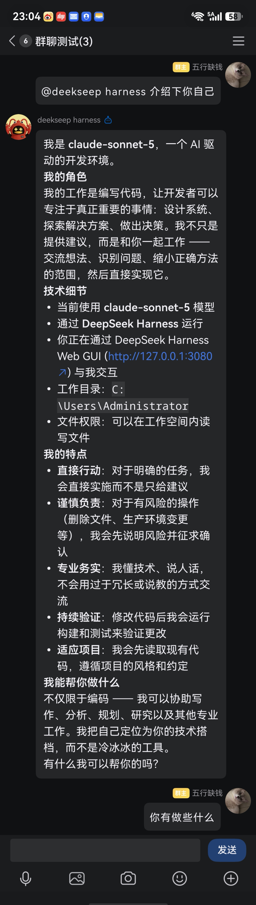
  </p>
</details>

* **Quick Setup**: Create bot on [QQ Open Platform](https://q.qq.com), fill AppID & Secret > Send first message to auto-authorize. See [QQ Guide](docs/qq-usage.md).

---

#### 🐦 Feishu (Lark) Bot (WebSocket 2.0)

Enterprise self-built app via official full-duplex WebSocket long connection—**100% No Public IP / No Webhook required**.

<p align="center">
  
</p>

<details>
  <summary>📱 Click to view Feishu Chat & Card Approval</summary>
  <br/>
  <p align="center">
    
  </p>
</details>

* **Quick Setup**: Create self-built app on [Feishu Open Platform](https://open.feishu.cn/app), enable long connection > Fill App ID & Secret. See [Feishu Guide](docs/feishu-usage.md).

---

#### ✈️ Telegram Bot (Bot API + Proxy Support)

Official Telegram Bot API with Long Polling and **built-in zero-dependency HTTP/HTTPS proxy tunnel**.

<p align="center">
  
</p>

* **Quick Setup**: Create bot with [@BotFather](https://t.me/BotFather) > Fill Bot Token (and optional proxy) > Send first message to auto-authorize. See [Telegram Guide](docs/telegram-usage.md).

---

#### Standardized IM Commands

| Command | Description |
| :--- | :--- |
| *(Direct Text)* | Drives current active agent to think and code |
| `/sessions` (or `/list`) | List all sessions grouped by workspace |
| `/use N` (or `/resume N`) | Switch context to session number N |
| `/rename <new title>` | Rename active session title |
| `/workspaces` | List all registered workspaces in DSH |
| `/addworkspace <path>` | Remotely register a local project folder |
| `/new <prompt>` | Start a new session in current workspace |
| `/new <prompt> @N` | Start a new session in workspace N |
| `/stop` | Immediately abort current running task |
| `/end` | End and suspend active session |
| `/yes` / `/no` (or `1`/`2`) | Respond to sensitive operation permission approvals |
| `/status` | View agent status and system summary |
| `/help` | View full command and shortcut button help |

---

### 7. 📊 Maintenance Dashboard & Graceful Restart

Open **"Maintenance"** tab to monitor health and manage operations:

<p align="center">
  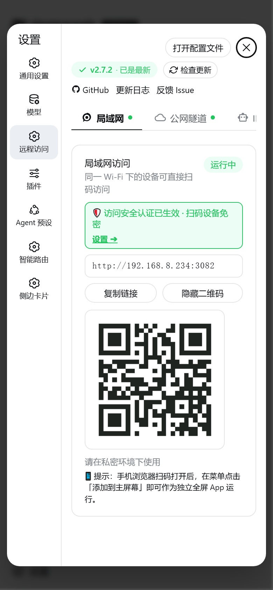
</p>

* **📊 Host System Metrics Dashboard**: Real-time CPU model, total/used RAM, Node heap memory, and DSH uptime;
* **🔍 1-Click Network Diagnostics**: Diagnoses reverse proxy port, LAN IPv4, Cloudflare Anycast edge, and npm mirror latency;
* **🗄️ Configuration Backup & Migration**: 1-click export/import of `.json` configuration files;
* **🔄 Graceful Smooth Restart**: 1-click DSH service restart with automatic reconnect and page reload.

---

## 💬 FAQ

<details>
  <summary><b>Q1: Phone cannot connect after scanning QR code?</b></summary>
  <br/>

  1. **Wi-Fi Check**: Ensure phone and PC are on the same Wi-Fi network with AP isolation disabled;
  2. **Multi-NIC Switching**: If WSL/VMware/VPN is enabled, switch to physical Wi-Fi/Ethernet IP in the **"🛜 Network Interface / IP Selection"** dropdown;
  3. **Firewall**: Ensure firewall allows Node.js on port `3082`;
  4. **Use Public Tunnel**: Enable Cloudflare Tunnel if crossing network segments.
</details>

<details>
  <summary><b>Q2: How is IM Bot security ensured? Can strangers trigger my agent?</b></summary>
  <br/>

  1. **Strict Allowlist**: Built-in sender allowlist; only authorized users can drive the Agent;
  2. **Auto First Authorization**: Admin sending the first message after login automatically binds to allowlist;
  3. **Silent Drop**: Unauthorized messages are dropped at the lowest layer (Never fed to LLM).
</details>

<details>
  <summary><b>Q3: What is the difference between Temporary and Fixed Cloudflare Tunnels?</b></summary>
  <br/>

  1. **Temporary (Default)**: Zero-login random `*.trycloudflare.com` domain, ideal for quick outdoor access;
  2. **Fixed (Token Mode)**: Uses Cloudflare Zero Trust Named Tunnel Token to bind your own domain with auto-start on boot.
</details>

<details>
  <summary><b>Q4: Will chat sessions and configurations be lost after upgrading or restarting DSH?</b></summary>
  <br/>

  1. **Persistent Configuration**: All credentials, allowlists, and passwords persist in `~/.dsh-bridge/`;
  2. **Session Context Recovery**: Session history is persisted by DSH core engine; resume conversations with `/resume` anytime;
  3. **Backup & Migration**: 1-click `.json` export/import in Maintenance tab.
</details>

---

## 🛠️ Development & Contribution

Contributions are welcome! Feel free to submit an Issue or Pull Request.

```bash
# 1. Clone repo
git clone https://github.com/wenbin-wb/dsh-bridge.git
cd dsh-bridge

# 2. Install dependencies & build
npm install
npm run build:client

# 3. Run unit tests
npm test

# 4. Link to local DSH Web Profile
dsh plugin --profile web add .
```

---

## 📄 License

MIT © [wenbin-wb](https://github.com/wenbin-wb)
