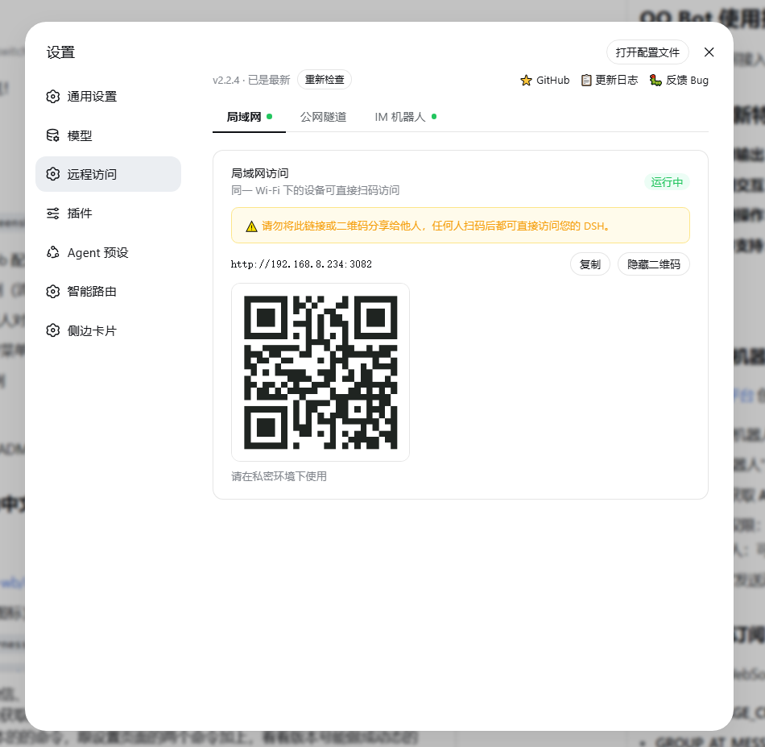

# dsh-bridge

简体中文 | [English](README.en.md)


> DeepSeek Harness 多通道远程访问插件

手机扫个码，人不在电脑前也能继续用 DeepSeek Harness。躺在沙发上、出差在外、跨网访问——都不用守着电脑，也不用自己搭公网服务器，扫码就能在手机/平板或任意设备上接着干。

把你本地的 DeepSeek Harness 无缝延伸到手机、平板、公网、甚至微信 / QQ。无论你在哪，都能通过扫码、网页或 IM 机器人，随时调用你的 AI 助手。

---

## 功能特性

- **局域网访问**：手机/平板扫码，同一 Wi-Fi 直接访问，躺着也能在手机上接着聊
- **Cloudflare 隧道**：一键暴露公网地址，随时随地连接，出差在外、不在家也能接着干，无需自建公网服务器
- **自建隧道**：连接自己的隧道服务器，获得固定域名（[搭建教程](docs/custom-tunnel.md)）
- **微信 Bot（ClawBot / iLink）**：扫码登录微信个人号后，直接在微信里对话、控制 DeepSeek Harness 的 agent。**支持多工作区选择、会话跨重启持久化、按工作区分组查看、媒体（图片/文件/语音）收发、权限审批**——走腾讯官方 iLink Bot API，无需公网（[使用说明](docs/wechat-usage.md)）
- **QQ Bot（OpenAPI v2）**：接入 QQ 机器人，私聊/群聊接收消息，发送 Markdown、按钮键盘和富媒体。**完整事件覆盖（C2C / GROUP_AT_MESSAGE_CREATE）、Token 自动刷新、断线重连、消息去重**——走腾讯官方 QQ Bot OpenAPI v2（[使用说明](docs/qq-usage.md)）
- **飞书 Bot（官方 WebSocket 长连接）**：接入飞书开放平台企业自建应用，私聊/群聊实时交互。**无需公网 IP / 无需 Webhook、支持飞书 Markdown 表格排版、原生交互卡片权限审批一键点击确认**——走飞书官方最新 WebSocket 长连接协议（[使用说明](docs/feishu-usage.md)）
- **Telegram Bot（官方 Bot API + 代理支持）**：接入官方 Telegram 机器人，单聊/群聊实时交互。**无需公网 IP（长轮询 getUpdates）、内置零依赖 HTTP/HTTPS 代理隧道、打字机平滑流式输出、原生快捷指令菜单（Menu 按钮）与 Inline 交互卡片审批**（[使用说明](docs/telegram-usage.md)）
- **IM 官方品牌矢量图标**：微信、QQ、飞书、Telegram 官方矢量图标与状态展示，直接在聊天软件里呼唤你的 Agent
- **极速版本检查与一键升级**：国内高速镜像（npmmirror）优先 + 官方源毫秒级双通道检查，检测到新版本支持**界面一键直接升级**，无需手动打开终端
- **深色模式深度适配**：完美适配 DeepSeek Harness 设计系统明暗主题切换，二维码自带白底安全垫，暗光下手机扫码 100% 极速识别
- **安全提示**：URL 和二维码带访问警告，防止误分享


---

## 开发路线图

| 目标 | 说明 | 状态 |
|------|------|------|
| **平台抽象层** | 平台无关的核心（会话/审批/命令/digest）跨 IM 渠道复用 | ✅ **已完成**（v2.0.0） |
| **微信** | 在微信里直接与你的 Agent 对话 | ✅ 已支持（多工作区 / 会话持久化 / 媒体 / 审批） |
| **QQ Bot** | 接入 QQ 机器人，群聊/私聊唤起 Agent | ✅ **已完成**（v2.1.0）— Markdown / 按钮 / 富媒体 |
| **飞书** | 飞书开放平台长连接机器人，办公场景直接调用 | ✅ **已完成**（v2.3.0）— 免公网 WS / 卡片审批 |
| **Telegram** | 适合自托管与海外的 IM 渠道 | ✅ **已完成**（v2.4.0）— 免公网长轮询 / 代理支持 / 原生菜单 / Inline 卡片 / 流式打字机 |
| **OpenClaw** | 与 OpenClaw 生态打通 | 规划中 |

---

## 环境要求

安装插件前，请先确保：

1. **Node.js ≥ 22** (DSH 要求 `^22.19.0` 或 `≥ 24.0.0`)
2. **dsh CLI 可用** — 能在终端直接运行 `dsh` 命令

```bash
# 检查 Node 版本
node -v   # 应显示 v22.19+ 或 v24+

# 检查 dsh 是否可用
dsh --version
```

如果 `dsh` 命令提示"无法识别/找不到"，先安装 DSH：

```bash
npm install -g @deepseek-ai/dsh
```

> 若没有全局安装的权限，也可以用 `npx` 方式：
> ```bash
> npx --yes @deepseek-ai/dsh plugin --profile web add @wenbin_wb/dsh-bridge
> ```

---

## 安装

### 从 npm 安装（推荐）

```bash
# 安装最新版
dsh plugin --profile web add @wenbin_wb/dsh-bridge

# 或指定版本（如 2.2.6）
dsh plugin --profile web add @wenbin_wb/dsh-bridge@2.2.6
```

> 💡 **没有全局安装权限？** 使用 `npx` 方式：
> ```bash
> npx --yes @deepseek-ai/dsh plugin --profile web add @wenbin_wb/dsh-bridge
> ```

### 从源码安装

```bash
git clone https://github.com/wenbin-wb/dsh-bridge.git
dsh plugin --profile web add ./dsh-bridge
```

安装完成后重启 DSH，在设置页找到「远程访问」即可使用。

### 升级到最新版

```bash
# 方式一：在设置页「远程访问」中点击「🚀 一键升级到 vX.X.X」（推荐，全自动）

# 方式二：终端强制安装最新版
dsh plugin --profile web add @wenbin_wb/dsh-bridge@latest
```

> **注意**：`update --latest` 可能因已安装依赖的版本约束而无法升级到最新版。用上面的 `add @latest` 命令即可强制安装最新版（无需知道具体版本号）。

#### 升级后仍是旧版本？（pnpm 11 新版本过滤）

如果你刚发布后立即升级，`add @latest` 可能仍然装到旧版本。这是 **pnpm 11 的供应链安全机制 `minimumReleaseAge`**（默认过滤发布不足 24 小时的新版本）导致的，不是插件问题。

**解决方法**（任选其一）：

1. **直接在 DSH Web 设置页的「远程访问」点击「一键升级」**（自动带具体版本号安装，即刻生效）
2. **在 profile 的 `pnpm-workspace.yaml` 添加 `minimumReleaseAge: 0`**，然后重新 `pnpm install`（一劳永逸）
3. **等待 24 小时**：发布满 1 天后保护自动解除

升级完成后重启 DSH，并在浏览器**硬刷新**（Windows: `Ctrl+Shift+R`，macOS: `Cmd+Shift+R`）清除缓存，然后确认设置页显示最新版本号。

---

## 使用

### 局域网访问

插件启动后自动开启，无需任何配置。打开设置页「远程访问」，用手机扫描二维码即可访问。



### Cloudflare 隧道

1. 点击「Cloudflare 隧道」卡片中的「开启」按钮
2. 首次使用会自动从 GitHub 下载 cloudflared（约 30MB）
3. 下载完成后自动启动，几秒内显示公网 URL 和二维码
4. 每次重启后 URL 会变化；点「重置链接」可主动获取新 URL

### 自建隧道

需要一台有公网 IP 的服务器。详细搭建步骤见 [自建隧道教程](docs/custom-tunnel.md)。

1. 按教程在服务器上部署隧道服务端
2. 在「自建隧道」卡片中填写 WebSocket 地址（`wss://...`）和访问令牌
3. 点「保存配置」后点「开启」

配置自动持久化，重启后无需重新填写。

### 微信 Bot（ClawBot / iLink）

基于腾讯官方开放的微信 ClawBot 插件功能（底层 iLink Bot API），扫码登录微信个人号后，即可在微信里直接与你的 DeepSeek Harness agent 对话、控制和审批，全程走腾讯官方服务器，无需公网与隧道。


**功能亮点**

- 🗂️ **多工作区**：`/workspaces` 查看工作区，`@N` 或 `@路径` 指定项目目录新建会话
- 💾 **会话持久化**：重启 DSH 后会话不丢失，直接续聊
- 🏷️ **会话标题**：`/sessions` 按工作区分组、显示每个会话的标题，一眼可辨
- 🖼️ **媒体收发**：支持图片/文件/语音（自动转文字）双向传输
- 📝 **审批问答**：敏感操作在微信里审批，超时自动拒绝
- 🔔 **状态推送**：任务进行中心跳进度 + "正在输入"指示，长回复自动分条

**使用步骤**

1. 打开设置页「远程访问」→「IM 机器人」→ 选中「微信」
2. 点「扫码登录」，用微信扫二维码并按提示确认
3. 登录成功后，**向该微信 Bot 发送第一条消息即自动完成白名单授权**（一步到位）
4. 之后就可以在微信里下命令了

**微信里的命令**（完整说明见 [微信 Bot 使用说明](docs/wechat-usage.md)）

| 命令 | 说明 |
|------|------|
| *(普通文本)* | 发给当前活动 agent |
| `/sessions`（或 `/list`） | 列出会话（按工作区分组，带标题） |
| `/use N`（或 `/resume N`） | 切换到会话 N |
| `/workspaces` | 列出可用工作区 |
| `/new <提示词>` | 新建会话并开始（当前工作区） |
| `/new <提示词> @N`（或 `@路径`） | 在指定工作区新建会话 |
| `/stop` | 停止当前任务 |
| `/end` | 结束当前会话 |
| `/status` | 查看 agent 状态与会话摘要 |
| `/yes` `/no`（或 `1`/`2`） | 回应权限审批请求 |
| `/start` | 首次扫码后自动开始一个会话 |
| `/help` | 查看全部命令 |

**安全说明**

- 强制白名单：仅白名单内的微信用户能驱动 agent，其他人发的消息会被忽略、绝不喂给模型
- 审批默认拒绝：权限请求在规定时间（默认 10 分钟）内未回复 `/yes` 则自动拒绝
- 凭证存于 DSH 凭证服务，不落配置明文
- 同一微信账号同一时间只允许一个 Bot 轮询（iLink 独占锁）；若同时使用 hermes-agent / OpenClaw 会互相 403。**请使用专用微信账号**承载 Bot

> 声明：iLink 为腾讯官方开放通道，仍需遵守《微信 ClawBot 功能使用条款》，腾讯保留内容过滤和限速的权利。不建议用于核心业务。

---

### QQ Bot（OpenAPI v2）

接入 QQ 官方机器人，支持单聊/群聊（群聊需 @机器人）、流式输出、Markdown 渲染、消息按钮、富媒体消息（图片/文件）。走腾讯官方 QQ Bot OpenAPI v2，WebSocket 实时推送，Token 自动刷新，断线自动重连。


**功能亮点**

- 💬 **单聊 + 群聊**：私聊直接对话，群聊 @机器人 触发（首次 @自动授权该群）
- 📝 **流式 Markdown**：实时流式输出，代码高亮、表格、列表完整渲染
- 🎯 **消息按钮**：/end 等命令触发快捷按钮（新建会话/列表/帮助），需最新版 QQ 客户端
- 🖼️ **富媒体**：图片/文件双向传输
- 🔄 **会话管理**：多会话切换、持久化、按工作区分组
- ✅ **自动授权**：单聊首次发消息、群聊首次 @机器人 自动加白名单

**使用步骤**

1. 前往 [QQ 开放平台](https://q.qq.com) 创建机器人应用，获取 AppID 和 ClientSecret
2. 打开设置页「远程访问」→「IM 机器人」→ 选中「QQ」
3. 填入 AppID 和 ClientSecret，点「保存配置」后自动连接
4. **单聊**：添加机器人好友，发送第一条消息自动完成授权
5. **群聊**：将机器人拉入群，@机器人 发送消息（首次 @自动授权该群）

**QQ 里的命令**（完整说明见 [QQ Bot 使用说明](docs/qq-usage.md)）

| 命令 | 说明 |
|------|------|
| *(普通文本)* | 发给当前活动 agent |
| `/new <提示词>` | 新建会话并开始 |
| `/sessions`（或 `/list`） | 列出会话（按工作区分组） |
| `/use N`（或 `/resume N`） | 切换到/恢复会话 N |
| `/end` | 结束当前会话（触发快捷按钮） |
| `/stop` | 停止当前任务 |
| `/status` | 查看 agent 状态 |
| `/workspaces` | 列出可用工作区 |
| `/help` | 查看全部命令 |

**重要提示**

- **自定义菜单 / 指令面板 / 消息按钮需要最新版 QQ 客户端**（2026-08-12 新功能，手机版优先支持）
- API 配置成功但客户端不显示是正常现象——更新 QQ 到最新版再试，或等官方灰度全量开放
- 纯文字命令（如 `/new` `/sessions` `/help`）在任何版本都完全可用

---

### 飞书 Bot（官方 WebSocket 长连接）

接入飞书开放平台企业自建应用，支持单聊与群聊（群聊需 @机器人）。走飞书官方最新 WebSocket 长连接协议，无需公网 IP、无需域名、免配置 Webhook。

**功能亮点**

- ⚡ **100% 免公网 IP**：官方 WebSocket 全双工长连接，本地电脑即可直连飞书开放平台
- 📜 **Card JSON 2.0 原生流式打字机**：单条卡片原地增量打字机更新，彻底告别气泡拆分碎片化
- 🛡️ **Card 2.0 交互卡片审批**：敏感操作触发审批时下发橙色告警卡片，手机/电脑端点击 `[✓ 批准执行]` / `[✕ 拒绝执行]` 按钮一键处理
- 📝 **全量 Markdown 渲染**：支持多级标题、表格、代码高亮、引用块与列表
- 🔄 **会话与工作区管理**：支持 `/sessions` 表格化查看、`/use N` 切换、`/workspaces` 查看工作区

**使用步骤**

1. 前往 [飞书开放平台](https://open.feishu.cn/app) 创建企业自建应用，开启「机器人」能力并发布版本（详见 [飞书接入指南](docs/feishu-usage.md)）
2. 在「事件与回调」中开启「使用长连接接收事件」，添加 `im.message.receive_v1` 和 `card.action.trigger` 事件
3. 打开 DSH 设置页「远程访问」→「IM 机器人」→ 选中「飞书」
4. 填入 App ID 和 App Secret，点击「保存并连接」即可

**飞书里的命令**（完整说明见 [飞书 Bot 使用说明](docs/feishu-usage.md)）

| 命令 | 说明 |
|------|------|
| *(普通文本)* | 发给当前活动 agent |
| `/new <提示词>` | 在当前工作区新建会话并开始 |
| `/new <提示词> @N` | 在指定工作区新建会话 |
| `/sessions`（或 `/list`） | 查看所有历史会话（结构化表格排版） |
| `/use N`（或 `/resume N`） | 切换到会话 N |
| `/workspaces` | 列出可用工作区 |
| `/end` | 结束当前会话 |
| `/stop` | 停止当前任务 |
| `/status` | 查看 agent 状态看板 |
| `/yes` `/no`（或 `1`/`2`） | 响应权限审批请求（或直接点击卡片按钮） |
| `/help` | 查看全部命令 |

---

### Telegram Bot（官方 Bot API + 代理支持）

接入 Telegram 官方 Bot API，单聊与群聊实时交互。采用官方 Long Polling（长轮询）机制，**无需公网 IP / 免 Webhook**，内置**零依赖 HTTP/HTTPS CONNECT 代理隧道**，国内网络即开即连。

**功能亮点**

- ⚡ **100% 免公网 IP**：官方 Long Polling 长轮询，本地电脑或内网服务器即可直连通信
- 🌐 **内置 HTTP/HTTPS 代理支持**：支持填写本地 Clash / v2ray 代理（如 `http://127.0.0.1:7890`），零外部依赖
- 📜 **实时打字机流式输出**：接入轮次生命周期，单条气泡原地 `editMessageText` 增量刷新，告别频繁发碎消息
- 🎯 **原生快捷指令菜单（Menu 按钮）**：自动注册全范围指令，输入 `/` 或点击左下角 `[Menu]` 按钮一键直达常用命令
- 🛡️ **Inline Keyboard 交互卡片**：权限审批下发 `[✓ 批准执行]` / `[✕ 拒绝执行]` 按键，一秒点击即时放行
- 🖼️ **多模态与文件传输**：支持入站图片/文档自动转存交付 Agent，出站产物文件自动推回 Telegram
- 🔄 **会话与工作区管理**：支持 `/sessions` 列出历史会话、`/use N` 切换、`/workspaces` 调度工作区

**使用步骤**

1. 在 Telegram 中向 [@BotFather](https://t.me/BotFather) 发送 `/newbot` 创建机器人并获取 **Bot Token**
2. 打开 DSH 设置页「远程访问」→「IM 机器人」→ 选中「**Telegram**」
3. 填入 **Bot Token**（国内网络可按需填入代理地址如 `http://127.0.0.1:7890`），点击「保存并连接」
4. 手机 Telegram 扫码打开机器人，发送第一条消息（如 `/help`）即**自动完成白名单授权**

**Telegram 里的命令**（完整说明见 [Telegram Bot 使用说明](docs/telegram-usage.md)）

| 命令 | 说明 | 交互卡片 |
|------|------|------|
| *(普通文本)* | 发给当前活动 agent | 实时打字机流式输出 |
| `/new <提示词>` | 在当前工作区新建会话并开始 | 立即启动新轮次 |
| `/new <提示词> @N` | 在指定工作区新建会话 | 多工作区调度 |
| `/sessions`（或 `/list`） | 查看所有会话列表 | 挂载一键切换按键 |
| `/use N`（或 `/resume N`） | 切换到会话 N | 快速切换上下文 |
| `/workspaces` | 列出可用工作区 | 查看工作区路径 |
| `/status` | 查看 agent 状态看板 | 挂载刷新/停止/结束按键 |
| `/stop` | 停止当前正在运行的任务 | 即刻中断执行 |
| `/end` | 结束当前活动会话 | 挂载快捷开始按键 |
| `/yes` `/no`（或 `1`/`2`） | 响应权限审批请求 | 支持直接点击卡片按钮 |
| `/help` | 显示快捷按键与完整帮助 | 挂载全套功能导航按键 |

---

## 可选配置

插件开箱即用，无需配置。如需修改代理端口，在 cordis.yml 中添加：

```yaml
- name: '@wenbin_wb/dsh-bridge'
  config:
    port: 3082  # 默认 3082
```

---

## 开发

```bash
git clone https://github.com/wenbin-wb/dsh-bridge.git
cd dsh-bridge
npm install

# 修改 client/index.js 后重新构建
npm run build:client

# 安装到 web profile 并重启 DSH
dsh plugin --profile web add .
```

---

## 许可证

MIT © [wenbin-wb](https://github.com/wenbin-wb)
