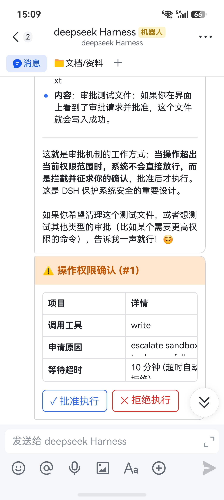

# 飞书 (Feishu / Lark) 机器人接入指南

> 通过飞书官方开放平台 **WebSocket 长连接（免公网 IP）** 模式，将本地 DeepSeek Harness 接入飞书，支持单聊、群聊、表格命令与原生交互卡片权限审批。

---

## 🌟 核心优势

- **100% 免公网 IP**：基于飞书官方最新 WebSocket 长连接协议，无需配置公网服务器、无需域名、无需内网穿透工具。
- **免验签与加密配置**：长连接由飞书官方 SDK 在建立通道时完成认证，无需开发者手动处理 HTTP 回调验签。
- **飞书原生交互卡片**：Agent 触发敏感工具审批时，飞书端下发带点击按钮的交互卡片，手机/电脑端单手一键点击即可完成批准或拒绝。
- **多工作区与会话持久化**：支持 `/sessions` 表格查看历史会话、`/use <序号>` 极速切换、`/workspaces` 工作区调度。

---

## 🛠️ 第一步：创建飞书企业自建应用

1. 登录 [飞书开放平台开发者后台](https://open.feishu.cn/app)；
2. 点击右上角 **「创建企业自建应用」**，填写应用名称（如 `DeepSeek Harness`）与应用描述，上传机器人头像；
3. 创建完成后，在左侧导航栏点击 **「凭证与基础信息」**，即可查看到：
   - **App ID**（格式如 `cli_a1b2c3d4...`）
   - **App Secret**（点击复制密钥）

---

## 🤖 第二步：添加机器人能力

1. 在应用详情页左侧导航栏，点击 **「添加应用能力」**；
2. 找到 **「机器人」**，点击 **「添加」** 开启机器人能力。

---

## 🔐 第三步：开通必要权限

在左侧导航栏点击 **「权限管理」**，搜索并开通以下权限：

| 权限名称 | 权限 Key | 权限说明 |
| :--- | :--- | :--- |
| **获取与发送单聊/群聊消息** | `im:message` | 基础消息收发权限 |
| **以应用的身份发消息** | `im:message:send_as_bot` | 允许机器人向用户/群回复消息 |
| **获取群组中所有消息** | `im:message.group_msg` | 允许机器人在群聊中被 `@` 时接收消息 |
| **获取用户 user ID** | `contact:user.id:readonly` | (可选) 获取用户信息 |

---

## ⚡ 第四步：开启 WebSocket 长连接事件订阅

1. 在左侧导航栏点击 **「事件与回调」**；
2. 在 **「事件配置」** 页面，将事件接收方式切换为 **「使用长连接接收事件」**（WebSocket 模式）；
3. 点击 **「添加事件」**，勾选并添加：
   - **`im.message.receive_v1`**（接收消息）
   - **`card.action.trigger`**（消息卡片回传交互 / 审批按钮点击）
4. 保存配置。

---

## 🚀 第五步：版本发布

1. 在左侧导航栏点击 **「版本管理与发布」**；
2. 点击 **「创建版本」**，填写版本号（如 `1.0.0`），设置应用可用范围（如「所有员工」或「仅自己」）；
3. 点击 **「申请发布」**（自建应用通常由企业管理员直接免审或一键通过）。

---

## 📱 第六步：在 DSH 客户端中连接

1. 打开 DeepSeek Harness，进入「设置」➔「远程访问」➔「IM 机器人」➔ 选择 **「飞书」**；
2. 在表单中填入刚才复制的 **App ID** 和 **App Secret**；
3. 点击 **「保存并连接」**；
4. 状态显示为绿色 **「已连接」** 即表示长连接成功建立！

---

## 💬 常用操作与指令

在飞书与机器人单聊或在群里 `@机器人` 即可开始对话：

### 1. 会话与工作区管理
| 指令 | 说明 | 示例 |
| :--- | :--- | :--- |
| `/sessions` | 查看所有历史会话表格 | `/sessions` 或 `/list` |
| `/use <编号>` | 切换到指定编号会话 | `/use 1` 或 `/resume 1` |
| `/new <提示词>` | 在当前工作区创建新会话并开始 | `/new 帮我写个脚本` |
| `/new <词> @N` | 在指定工作区新建会话 | `/new 帮我写个脚本 @1` |
| `/rename <新标题>` | 重命名当前活动会话 | `/rename 优化登录交互` |
| `/workspaces` | 查看所有已注册的工作区列表 | `/workspaces` |
| `/addworkspace <路径>` | 注册添加新的电脑工作区目录 | `/addworkspace D:\projects\app` |
| `/status` | 查看 Agent 运行状态看板 | `/status` |
| `/stop` | 中断停止当前正在执行的任务 | `/stop` |
| `/end` | 结束当前会话回到空闲状态 | `/end` |

### 2. 权限审批交互
当 Agent 尝试执行需授权的操作（如终端命令、写敏感文件）时，飞书端会自动推送 **原生交互卡片**：
- 点击卡片上的 **「✓ 批准执行」** 或 **「✕ 拒绝执行」** 按钮即可一键处理；
- 亦可直接回复文字 `/yes` (或 `1`) / `/no` (或 `2`)。

---

## ❓ 常见问题 (FAQ)

### Q1: 点击卡片上的「批准」/「拒绝」按钮提示无权限或无反应？
请依次核对以下三项飞书开放平台配置：
1. **是否订阅了卡片交互事件**：在开放平台后台 **「事件与回调」➔「事件配置」** 中，必须添加 **`card.action.trigger`**（消息卡片回传交互）事件。若只添加了接收消息事件，卡片点击不会下发回调。
2. **是否发布了新版本生效**：飞书平台的所有权限与事件变更，**必须在「版本管理与发布」中「创建版本」并申请发布通过后才会生效**。
3. **应用可用范围**：在「版本管理与发布」中，确认应用可用范围包含了您当前的飞书账号（建议设为「所有员工」或将自己加入可用成员）。
4. **快速应急处理**：如果卡片按钮暂时受网络或配置影响，可直接在聊天中回复文字 **`/yes`**（或 `1`）批准，回复 **`/no`**（或 `2`）拒绝。

### Q2: 机器人无法在群聊中回复消息？
1. 确保在「权限管理」中开通了 **`im:message.group_msg`**（获取群组中所有消息）权限；
2. 确保在「版本管理与发布」中发布了包含该权限的新版本；
3. 将机器人拉入群聊后，需要 **`@机器人`** 唤醒并发送指令。

